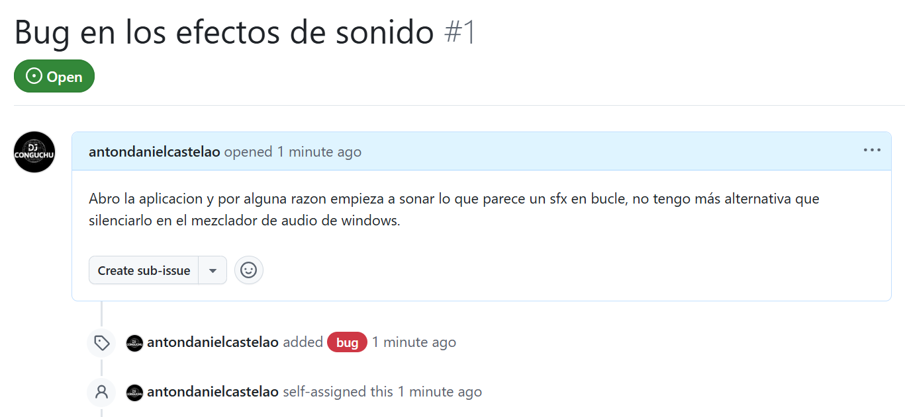

# Examen COD Anton Davila
## Crear las ramas
```bash
# nos aseguramos de que esta la rama main creada
git branch
# empezamos a crear
git checkout -b datos
git checkout -b interface
git checkout -b readme
```
## Commits del desarrollo de la release
Empezamos por los **commits de la branch datos**
```bash
git checkout datos
# proceso para hacer un commit (repetido varias veces)
git add .\scr\Datos.java
git commit -m "conexion base de datos"
```
Repetimos el proceso y hacemos un par de commits en la branch interface
```bash
git checkout interface
# proceso para hacer un commit (repetido varias veces)
git add .\scr\Interface.java
git commit -m "terminada ventana interfaz"
```
## Mezclar las ramas
Para hacerlo más interesante, vamos a hacer un cambio en main y harémos un **rebase** en ambas ramas
```bash
git checkout main
# hacemos el cambio en la clase Main...
git add .\scr\Main.java
git commit -m "cambio de la funcion principal"

# vamos a las otras ramas y hacemos el rebase
git checkout interface
git rebase main

git checkout datos
git rebase main

git checkout readme
git rebase main
```
Terminamos el desarrollo de la conexion con la base de datos, por lo que **mezclamos la rama con nuestra rama principal**
```bash
git checkout main
git merge datos
```
Vamos a **continuar desarrollando la interfaz**, por lo que hacemos un par de commits más
```bash
git checkout interface

git add .\scr\Interface.java
git commit -m "comentario"
```
Nos equivocamos y hacemos un cambio que rompe la interfaz, por lo que queremos **retroceder**. Para ello hacemos uso de `git revert`.
```bash
git log --oneline # a traves de este comando conocemos el codigo HEAD del utlimo commit en el que es funcional el programa

git revert d4a33fb
# despues del revert hacemos un commit de los cambios
git commit -m "revert al anterior framework"
```
Hemos terminado la interfaz, por lo que vamos a mezclarlo con la rama main. Igualmente, como tenemos muchos commits desordenados y no hemos hecho muchos, vamos a resumir nuestro historial haciendo un **merge con squash**.
```bash
git checkout main
git merge --squash interface

# hacemos commit del archivo
git add .\src\Interface.java
git commit -m "implementacion interfaz"
```
## Gestionar una issue
Primero, **activamos la pestaña Issues** desde los ajustes del repositorio.

Creamos una incidencia desde la página de github.


Vamos a **hacer una rama a parte en la que gestionaremos esa incidencia** y haremos los commits oportunos. Al terminarla, mezclamos con la rama main y cerramos la issue.
```bash
# crear la rama
git checkout -b issue-1

# hacemos los commits oportunos
git add .\src\Interface.java
git commit -m "arreglado sfx"

# mezclamos con la rama main con squash
git checkout main
git merge --squash issue-1

# commit final que marca como solucionada la issue
git commit -m "Arreglada Issue #1: bucle sfx"
```

## Pull Request
Nos imaginamos que yo mismo soy **otro desarrollador que colabora en el proyecto**, y hago desde mi propia rama cambios.
```bash
git checkout -b colaborador
git add .\src\Colaborador.java
```